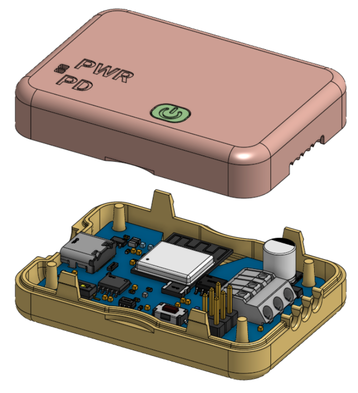

# MagWLED_Case
3D printable case for the excellent [MagWLED LED Controller](https://magwled.com/).

 

* Captured power button
* Light pipes for the `PWD` and `PD` status lights
* Recessed and chamfered USB-C port surround
* Locating posts for the board and snap-fit closure
* Coin slot on each side for easy opening
* Parameter lip to minimize dust path

